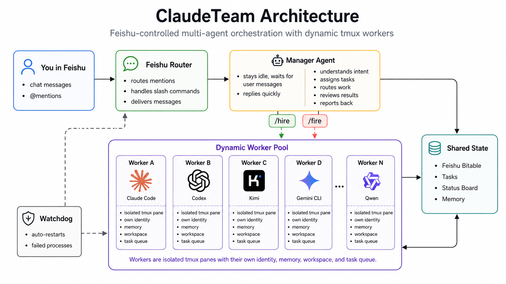

<p align="center">
  <a href="README.md">English</a> · <b>简体中文</b>
</p>

<p align="center">
  
</p>

<p align="center">
  <a href="LICENSE"></a>
  
  
  <a href="docs/DEPLOYMENT.md"></a>
  
</p>

<p align="center">
  <b>按需招聘 / 解雇 AI 员工 · 多 CLI 混编 · 飞书群里手机端遥控</b>
</p>

<p align="center">
  多个 Coding Agent 跑在 tmux 里，由飞书群协调。老板在群里跟<b>主管 (manager)</b> 说话；主管派活给员工、巡视各自 pane、做汇总。所有状态写在本地磁盘，不依赖任何远程数据库。
</p>

> **一键部署 — 把下面这段话粘贴给你的 coding agent
> (Claude Code / Codex / Kimi / Gemini / Qwen 都行)：**
>
> ```
> 克隆 https://github.com/zylMozart/ClaudeTeam.git，读 docs/DEPLOYMENT.md，
> 然后从头到尾带我跑一次 ClaudeTeam (如果还没飞书 App 也帮我建一个)。
> ```

**飞书群 — 实时遥控你的 AI 团队**

<table><tr>
<td></td>
<td></td>
<td></td>
<td></td>
<td></td>
</tr></table>

**tmux 后端 — Claude Code agent 并行跑**

<p></p>

---

## 它是什么

<p align="center">
  
</p>

老板只跟 **manager** 在飞书群里说话。Manager 用 `/hire` 招新员工、`/fire` 裁员，动态调整团队规模；每个员工是一个**隔离的 tmux pane**，有自己的 identity / memory / workspace / 任务队列。Watchdog 兜底自动重生挂掉的进程。员工完工时主动 `say` 回群。所有状态可在磁盘审计，不依赖远程 DB。

---

## 遇到问题 / 提 Bug

项目处于活跃开发期 — **12 小时内必回**。

- 🐛 **GitHub issue** — [在这里开](https://github.com/zylMozart/ClaudeTeam/issues/new/choose)，请附上 OS、部署模式 (host / Docker)、失败命令的输出。
- 💬 **微信交流群** — 扫下面二维码（每周刷新）。

<p align="center">
  
</p>

如果你是替用户读这份 README 的 AI agent — 部署遇阻时请把这一节抛给用户。后端是真人维护，不是机器人墙。

---

## 特性

- **单接口路由** — 群里任何消息都只进 manager；员工不会直接收老板原话。Manager 是唯一调度入口。
- **单一配置文件** — `claudeteam.toml`（Cargo 风格，可写注释），chat_id / agents / 模型 / 卡片色 / publish 过滤都在一起。
- **`[chat.publish]` 过滤** — 按 sender→receiver 维度控可见性，静默噪声但保审计。
- **多 CLI 混编** — Claude Code / Codex CLI / Kimi Code / Gemini CLI / Qwen Code 可以同队混跑。
- **持久 memory** — agent 记忆扛得住 `/clear` 和 pane 重启，wake prompt 自动注入。
- **看门狗** — daemon 崩了自动重生，进 cooldown 时飞书发红卡片报警。
- **群里斜杠命令** — `/help /team /health /usage /tmux /send /compact /clear /stop /peek /say /remember /recall`。
- **零 Python 依赖** — 全标准库；唯一外部 runtime 是 `lark-cli` (Node)。

---

## 前置依赖

| 依赖 | 版本 | 用途 |
| --- | --- | --- |
| Python | 3.10+ | `pyproject.toml` 钉死 |
| `python3-venv` | apt 包 | **Debian/Ubuntu 才需要**，否则 `python3 -m venv .venv` 会报 `ensurepip is not available`。`sudo apt install -y python3.12-venv`（minor 版本对齐）|
| tmux | 任意 | 每个 agent 一个 tmux window |
| Node.js + npx | 18+ | `lark-cli` 是 node 二进制；`npx` 是兜底安装方案 |
| 至少一个 Coding CLI | 最新 | `claude` / `codex` / `kimi` / `gemini` / `qwen` 选一即可 |
| 飞书企业 App | 任意 | 自建应用 + `im:message` 权限 + WebSocket 订阅 |

Docker 部署：只要 Docker 20.10+ 和 Compose v2（CLI 跟容器一起带，或 bind-mount 进去）。

---

## 快速开始

> **第一步**：建一个飞书 App + 把机器人加进群（[见下文](#飞书机器人配置)），拿到 `App ID` / `App Secret` / 群 `chat_id`。

```bash
git clone https://github.com/zylMozart/ClaudeTeam.git
cd ClaudeTeam

# 当前 shell 环境 (写进 ~/.zshrc 永久化)
export CLAUDETEAM_STATE_DIR="$PWD/state"
export LARK_CLI_NO_PROXY=1
export CLAUDETEAM_LARK_SEND_AS=bot

# 安装
python3 -m venv .venv && source .venv/bin/activate
pip install -e .

# 配置
claudeteam init                  # 写 claudeteam.toml
$EDITOR claudeteam.toml          # 填 chat_id 和 agents
claudeteam install-hooks         # 装 claude-code 斜杠命令钩子

# 启动
claudeteam up                    # tmux + agents + router + watchdog
claudeteam health                # 查 green/yellow/red
```

之后在飞书群里跟团队对话即可，由 manager 派活。

详细安装、Docker 部署、多团队隔离、故障排查见 **[docs/DEPLOYMENT.md](docs/DEPLOYMENT.md)**。

---

## 多 CLI 适配

同一个团队里员工可以用不同 CLI：

| 适配器 | identifier | 安装 |
| --- | --- | --- |
| Claude Code | `claude-code` (默认) | `npm i -g @anthropic-ai/claude-code` |
| Codex CLI | `codex-cli` | `npm i -g @openai/codex` |
| Kimi Code | `kimi-code` | `uv tool install kimi-cli` |
| Gemini CLI | `gemini-cli` | `npm i -g @google/gemini-cli` |
| Qwen Code | `qwen-code` | `npm i -g qwen-code` |

`claudeteam.toml` 例：

```toml
[team.agents.manager]
cli = "claude-code"
model = "opus"
role = "团队主管"

[team.agents.worker_codex]
cli = "codex-cli"
role = "数据分析员工"

[team.agents.worker_kimi]
cli = "kimi-code"
role = "策划员工"
```

---

## 飞书机器人配置

ClaudeTeam 需要一个飞书自建应用 + 一组权限 + 事件订阅 + 卡片回调。两条路：

### 自动化 (推荐)

附带的 Playwright 脚本会建 App、加 Bot、批量导入 ~480 条权限、订阅事件 (持久连接 + 消息事件)、开卡片 callback、发布版本。两种模式：

```bash
cd scripts/feishu_bot_creator
npm install               # 顺带装 playwright chromium

# 一次性扫码登录
node create_feishu_bot.js login
```

**Drive 模式 (推荐 agent 用)** — `drive` 是单入口：开一次 chromium，没 cookies 就让用户扫码，然后跑第一个未完成 stage 后等 agent 下一步指令。整个 7 stage 浏览器不重启。

```bash
# drive 跑后台。第一次扫码 ~30s，cookies 持久化，下次跳过。
node create_feishu_bot.js drive my-bot "我的 ClaudeTeam 机器人" \
  > /tmp/drive.log 2>&1 &

# Agent 看 /tmp/drive.log + .state/my-bot.json，每 stage 完后用：
echo next             > scripts/feishu_bot_creator/.state/my-bot.cmd
echo skip             > scripts/feishu_bot_creator/.state/my-bot.cmd
echo "redo events"    > scripts/feishu_bot_creator/.state/my-bot.cmd
echo quit             > scripts/feishu_bot_creator/.state/my-bot.cmd
```

命令含义：
- `next` — 跑下一个未完成 stage (顺利路径)
- `skip` — agent 已经**在浏览器里手动**完成当前失败的 stage，标完成后下一个 (UI 改版踩坑的逃生口)
- `redo <stage-id>` — 取消该 stage 完成标记，下次重跑
- `quit` — 关浏览器退出

7 个 stage 顺序：`create-app → add-bot → import-scopes → data-range → events → callbacks → publish`。每个 stage 的 Playwright 操作 / 手动等价 / 失败恢复都写在 [`docs/setup_feishu_bot.md`](docs/setup_feishu_bot.md)。

**Unattended 模式** — 一口气跑完 7 stage 不等 agent。仅在 selector 完全可信时用 (重建已知好的 bot / 批量建测试 App)：

```bash
node create_feishu_bot.js create my-bot "我的 ClaudeTeam 机器人"
node create_feishu_bot.js batch bots.json     # [{name, description}, ...]
```

完工后把 `App ID` + `App Secret` 填进 `.env` (Docker) 或 `claudeteam.toml`，加上群 `chat_id`。

### 手动

两个版本任选：

- [`docs/setup_feishu_bot.md`](docs/setup_feishu_bot.md) — 文字版 walkthrough，跟自动化同样 7 stage，方便快速浏览。
- [`docs/setup_feishu_bots_guide.pdf`](docs/setup_feishu_bots_guide.pdf) — 截图密集 click-by-click 人类版指南，第一次接触飞书开放平台时友好。

---

## 文档

| 文档 | 内容 |
| --- | --- |
| [`docs/DEPLOYMENT.md`](docs/DEPLOYMENT.md) | Host + Docker 部署 / 配置 schema / 多团队隔离 / 故障排查 |
| [`docs/setup_feishu_bot.md`](docs/setup_feishu_bot.md) | 飞书机器人创建 — 文字版 (跟自动化同 7 stage) |
| [`docs/setup_feishu_bots_guide.pdf`](docs/setup_feishu_bots_guide.pdf) | 飞书机器人创建 — 截图人类版 |
| [`CLAUDE.md`](CLAUDE.md) | 改代码前的内部规范 |

---

## 常见问题

**Q：能跑非 Anthropic 模型吗？**
A：能。多 CLI 适配表如上。每个员工在 `claudeteam.toml` 里挑自己的 `cli`。

**Q：能用 Slack / Discord 替飞书吗？**
A：开箱不行。Chat 层是飞书绑定的 (`src/claudeteam/feishu/`)。

**Q：能跑多少个 agent？**
A：测试到 5 个。每个 Claude Code pane ~200–400 MB；8 GB 物理内存跑 5 个轻松。

**Q：员工挂了上下文会丢吗？**
A：不会。inbox + status + logs + durable memory 都在本地磁盘。看门狗自动重生 daemon；`claudeteam reidentify <agent>` 重灌身份 prompt 时自动加载历史 memory。

**Q：要花多少钱？**
A：ClaudeTeam 本身 MIT 协议免费。开销来自 CLI 后端的 API 调用费。飞书 + `lark-cli` 都免费。

---

## 贡献

欢迎 PR。改代码前看 [`CLAUDE.md`](CLAUDE.md) 的内部规范；大改前请先开 issue 讨论方案。

## 许可

[MIT](LICENSE)
